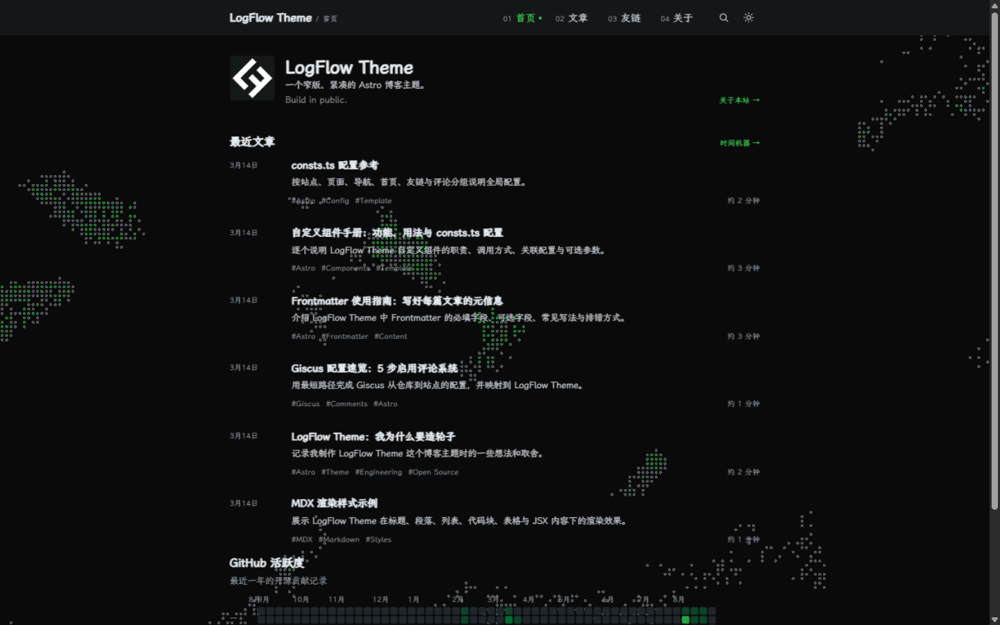
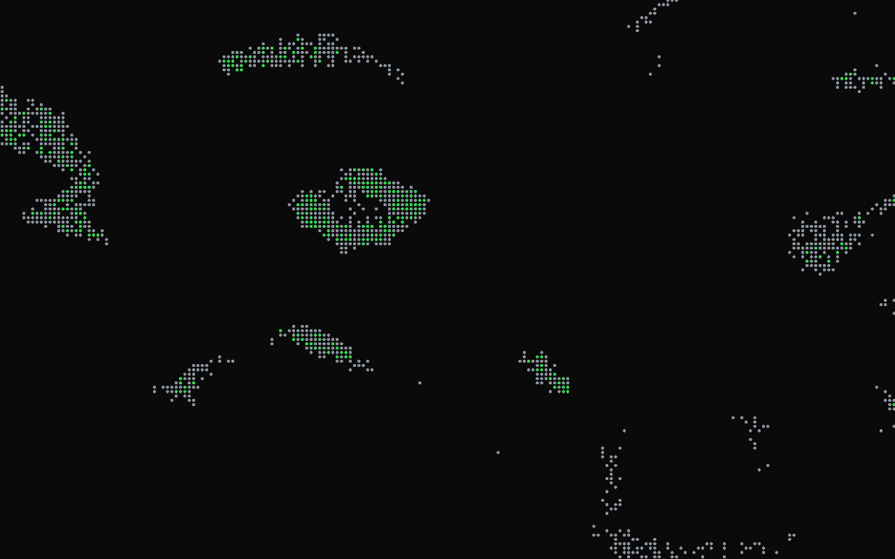
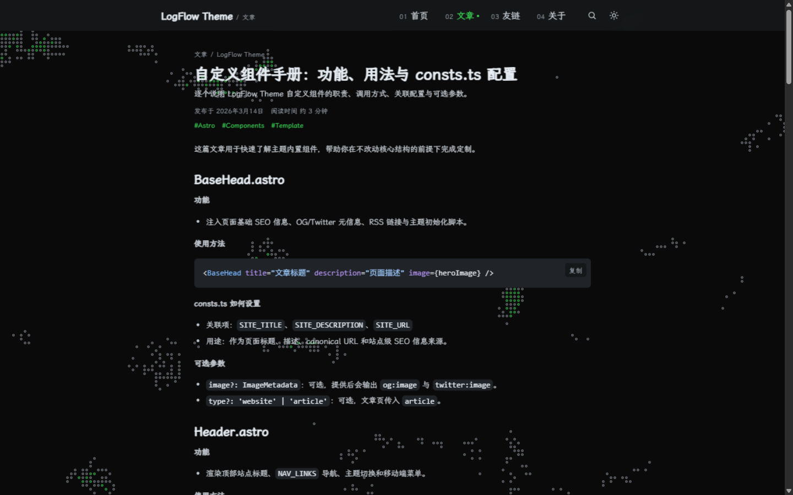
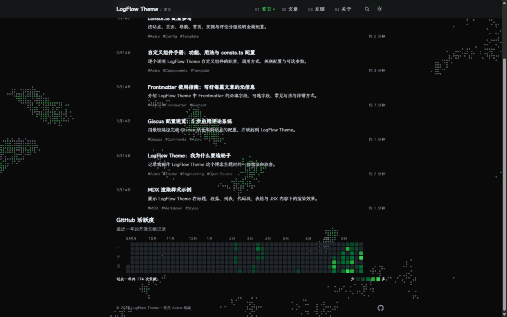
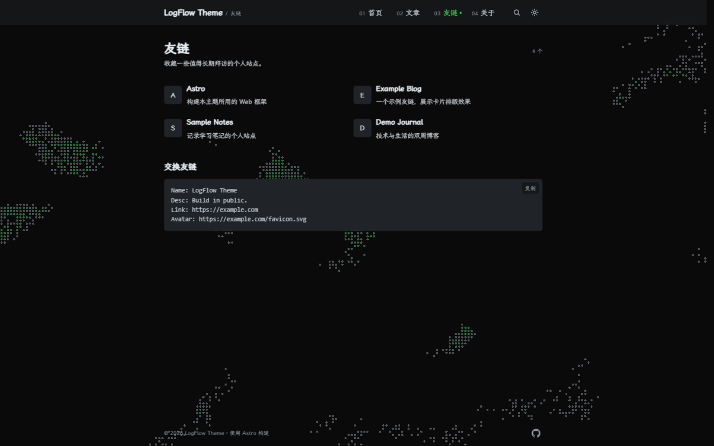
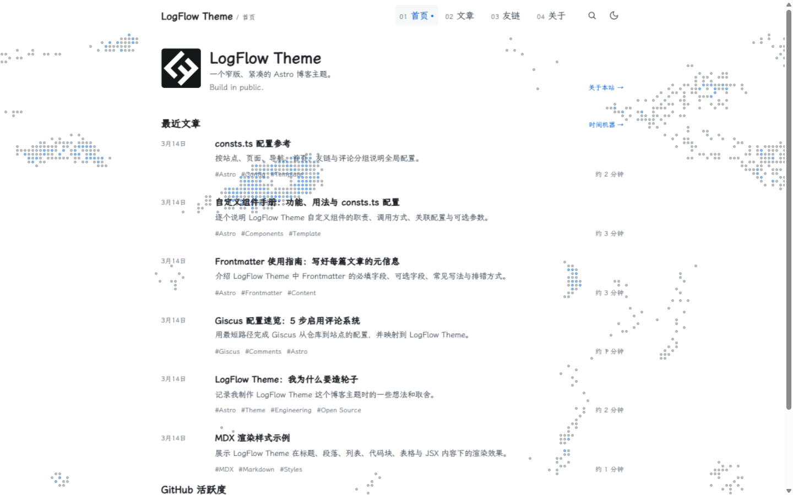

# LogFlow Theme

A compact, content-first Astro blog theme for writing, personal sites, and technical documentation.

<table>
  <tr>
    <td colspan="2" align="center"></td>
  </tr>
  <tr>
    <td colspan="2" align="center"></td>
  </tr>
  <tr>
    <td align="center"></td>
    <td align="center"></td>
  </tr>
  <tr>
    <td align="center"></td>
    <td align="center"></td>
  </tr>
</table>

## Features

- Markdown / MDX, syntax highlighting, one-click code copy, and optional hero images
- Collections, tags, year archives, friend links, and About page
- Dependency-free static post search across titles, descriptions, and tags
- Site-wide pixel fluid animation background: zero-dependency WebGL, follows the light/dark palette, with reduced-motion and no-WebGL fallbacks
- ClientRouter seamless page transitions with link prefetch; the animation persists across pages
- Light / dark theme, responsive mobile nav, and keyboard focus styles
- RSS, sitemap, canonical, Open Graph, and Twitter Card
- Optional Giscus comments and GitHub contribution graph
- GitHub Pages auto-deploy via Actions

## Quick Start

```bash
git clone https://github.com/kevynf/logflow-theme.git
cd logflow-theme
npm install
npm run dev
```

The dev server runs at `http://localhost:4321` by default. Requires Node.js `>=22.12.0`.

```bash
npx astro check
npm run build
npm run preview
```

## First-Time Setup

Most site information lives in `src/consts.ts`:

| Config | Purpose | Required |
| --- | --- | --- |
| `SITE_TITLE` | Site title, header, RSS | Yes |
| `SITE_DESCRIPTION` | Default SEO description | Yes |
| `SITE_URL` | Production site URL | Yes (for deploy) |
| `COPYRIGHT_NAME` | Footer copyright name | No |
| `PAGE_COPY` | Page titles and descriptions | No |
| `NAV_LINKS` | Desktop & mobile nav links | No |
| `SOCIAL_LINKS` | Footer social icon links | No |
| `HOME` | Avatar, bio, motto, recent posts limit | No |
| `GH_CONTRIBUTE` | GitHub contribution graph | No |
| `COMMENTS` | Giscus comment system | No |
| `SEARCH` | Search toggle and maximum result count | No |

Friend links live in `src/config/friend-links.ts`. Add entries following the `FriendLink` interface; when `avatar` is omitted, the first letter of the site name is shown instead.

Design tokens (colors, fonts, spacing, widths, radii) are at the top of `src/styles/global.css` as CSS custom properties.

## Writing

Posts go in `src/content/blog/` and support both `.md` and `.mdx`. Minimal frontmatter:

```yaml
---
title: My First Post
description: A one-line summary
pubDate: 2026-07-16
---
```

Full frontmatter:

```yaml
---
title: Frontmatter Best Practices
description: Post summary
pubDate: 2026-07-16
updatedDate: 2026-07-17
collection: Astro
collectionDescription: Astro theme development notes
tags:
  - Astro
  - Theme
heroImage: ./cover.png
---
```

`title`, `description`, and `pubDate` are required; all other fields are optional. No `heroImage` means no broken image or empty social image metadata.

## Search

The search index is generated at build time from post titles, descriptions, and tags in `src/content/blog/` only; post bodies are not included. The browser loads the index the first time search is opened, with no server or third-party search service required.

Open search from the Header icon or with `Ctrl/Command + K` or `/`. Use `↑` and `↓` to select a result and `Enter` to open it. Set `SEARCH.enabled` in `src/consts.ts` to show or hide search, and use `SEARCH.maxResults` to limit the number of displayed results.

## Giscus Comments

After enabling Discussions on your GitHub repository, edit `COMMENTS` in `src/consts.ts` and fill in `repoId` and `categoryId`. Comments are off by default; a configuration hint is shown when fields are incomplete.

## Images & Avatar

- **Avatar:** Omit `avatar` to use `public/favicon.svg` as the default.
- **Post images:** Store images alongside posts and reference them via `heroImage` (optional).
- **Favicon:** Replace `public/favicon.svg` to update both the default avatar and site icon.

## GitHub Pages

Set the repository's Pages Source to **GitHub Actions**. Pushing to `main` triggers an automatic deploy. The workflow sets `SITE_URL=https://<owner>.github.io` and `BASE_PATH=/<repository-name>`.

## Customization Boundaries

- Site copy & behavior: `src/consts.ts`
- Friend links: `src/config/friend-links.ts`
- Posts & About: `src/content/`
- Colors, fonts, spacing, layout density: `src/styles/global.css`
- Page structure: `src/pages/`, `src/layouts/`, `src/components/`

Prefer configuration and content for customizations; only modify components or layouts when the structure truly needs to change.

## License

MIT
